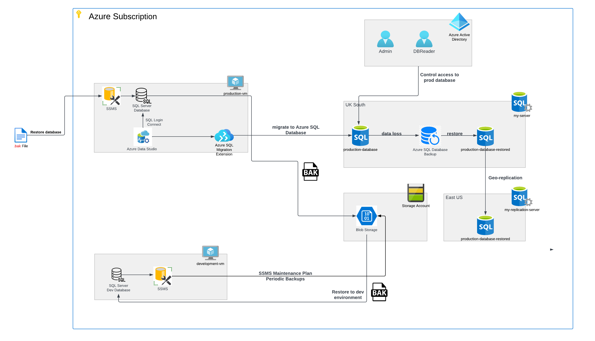
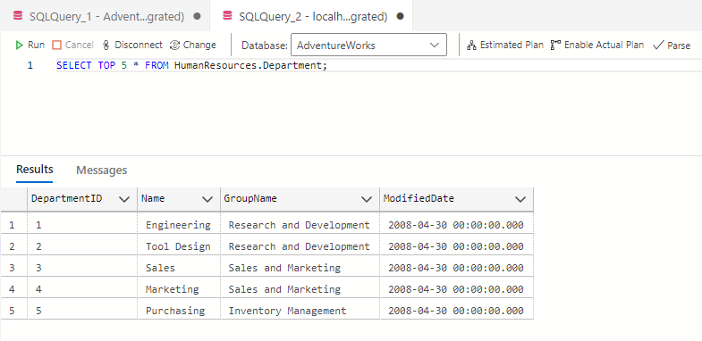
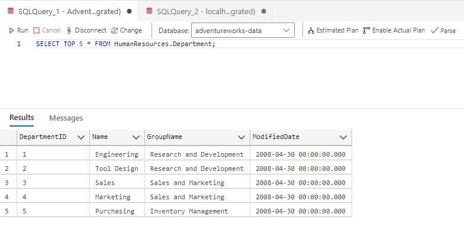
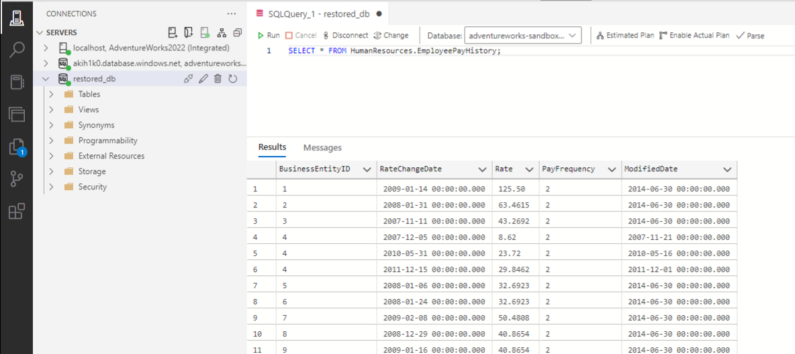
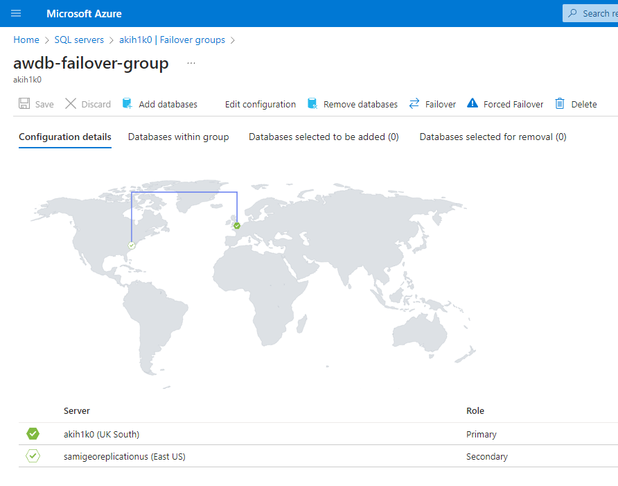
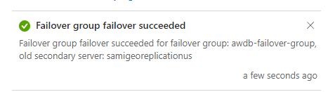
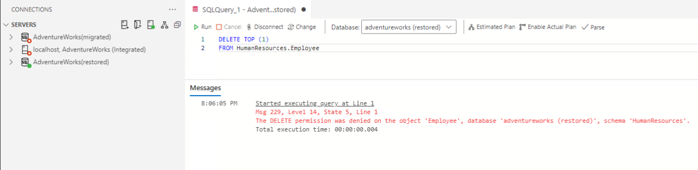

# Azure Database Migration
This project involves architecting and implementing a cloud-based database system on Microsoft Azure, demonstrating proficiency in cloud engineering. The process includes establishing a production environment database, migration to Azure SQL Database, and addressing key considerations such as data backup and restoration.

# Tasks Completed
    1. Restore and migrate AdventureWorks on the virtual machine.
    2. Query data to check uniformality.
    3. Implement automated backup strategies using SQL Server Management Studio (SSMS).
    4. Simulate a disaster recovery situation, mimicking data loss and restoration to a backup.
    5. Configure geo-replication to establish a synchronised copy of the Azure SQL database
    6. Integrate Microsoft Entra ID for enhanced security measure.

# Azure Database UML Diagram


## Milestone 1 & 2: Setup

**Azure VM Successfully Provisioned:**
- Azure VM Name: azure-database-migration
- VM Size: Standard B2ms (2 vcpus, 8 GiB memory)
- Operating System: Windows (Windows 11 Pro)
The Azure VM has been successfully provisioned with careful consideration for optimal performance and cost efficiency. The chosen VM size is Standard B2ms, featuring 2 vCPUs and 8 GiB memory, striking a balance between resource availability and budget constraints for the database migration task at hand. The decision to opt for Windows 11 Pro as the operating system stems from its compatibility with the necessary database migration tools and software requirements. This choice ensures a secure and stable environment, facilitating a smooth and efficient execution of the migration process while providing the necessary features and capabilities.

**Remote Desktop Connection Established:**

- RDP connection was used to connect to the Virtual Machine through Microsoft remote desktop.
RDP is used for direct access to the Windows VM, allowing easy configuration and monitoring. To make this connection work, firewall rules were set up to allow RDP traffic on port 3389, and an additional local port was added for enhanced security. Access is restricted to authorized IP addresses, and strong authentication measures, like complex passwords and Network Level Authentication (NLA), are in place. This ensures that only authorized users can remotely access the VM, enhancing overall security.

**Production Database Creation:**

- AdventureWorks backup file downloaded and copied to `C:\Program Files\Microsoft SQL Server\MSSQL16.MSSQLSERVER\MSSQL\Backup\AdventureWorks2022.bak`
- AdventureWorks database successfully restored on the Azure VM.
The restoration process involved using Microsoft SQL Server Management Studio (SSMS) on the Azure VM. The AdventureWorks backup file was placed in the appropriate directory for SQL Server to access (C:\Program Files\Microsoft SQL Server\MSSQL16.MSSQLSERVER\MSSQL\Backup\). In SSMS, the restore operation was performed, leveraging the software's capability to handle SQL Server backups. SSMS was chosen for its user-friendly interface and robust features, making it efficient for managing databases on both local and Azure servers.

## Milestone 3: Migration

Once a connection to the local database was established, a connection to the Azure SQL database was made, enabling the use of schema compare for a seamless migration. Authentication involved secure methods, and firewall configurations on the Azure SQL Server/Database were adjusted to permit access.

**Migration to SQL Database:**

- Once a connection to the local database was established a connection to the Azure SQL database was made allowing for the use of schema compare to allow for seamless migration.
- To compare the schema, tools like SQL Server Management Studio (SSMS) or Redgate SQL Compare were employed. These tools help identify and synchronize schema differences between databases, ensuring consistency.
- For a comprehensive migration, various extensions and services were utilized. A migration service played a crucial role in orchestrating and streamlining the transfer, ensuring efficiency. The schema comparison tools identified differences, and queries were executed to validate the integrity of the migrated data, ensuring a thorough and accurate transfer.
- The migration process utilized Azure Data Studio for runtime integration, establishing a connection to the migration service. This connection facilitated monitoring and management during the migration, ensuring a smooth transition.
- Queries were executed to compare the migrated data with the local database, confirming the successful transfer and data integrity.

- Local:

- Migrated:



## Milestone 4: Backup

**Development Environment**
The development environment is a sandbox replica of the main virtual machine to test new features and experiment with data without having any permenant damage. This is beneficial when testing the backup routine of the database. Using the development environment a backup maintanance plan was constructed and tested before completely being implemented in the main environment, allowing the backup plan to be tested before hand reduces the risk of errors and loss of data on the main.

**Backup data:**
A backup file of the AdventureWorks database was stored on the local machine and a blob on Microsoft Azure, allowing for further security to the data being recoverable. In order for the virtual machine to interact with the local machine a SQL server credential had to be created. This was done using the following query on SSMS:

```sql
-- Create Credential
CREATE CREDENTIAL [YourCredentialName]
WITH IDENTITY = '[Your Azure Storage Account Name]',
SECRET = 'Access Key';
```

A weekly backup maintenance plan was created in Microsoft SSMS. This was first tested in the Development Environment and then replicated to the live environment. Using SSMS's maintenance plan wizard a weekly backup at midnight was created, the full database would be backed up to a blob in a storage container on Azure this creates an area where not only can the data be found in case of emergency but can also be used to see the database history.

Using these techniques creates a safeguard from data loss and corruption. The main risks prevented are accidental deletion or alterations to data that could cause corruption and errors.

## Milestone 5: Disaster Recovery

By mimicking data loss, a disaster recovery situation can be simulated to ensure the backup and restoration is applied. The data from the adventureworks database was restored on Azure as a new SQL database and reconnected to on the virtual machines. This was done under the SQL databases tab in Azure by clicking restore and choosing the database and which specific date and time it would be restored to.
By using SQL queries the data was deleted and corrupted.

```sql
-- Intentional Deletion
DELETE TOP (100)
FROM HumanResources.EmployeePayHistory;

-- Data Corruption
UPDATE TOP (100) HumanResources.EmployeePayHistory
SET Rate = NULL;
```
This query deletes the first 100 rows and then sets the rate to Null. This was the disaster situation and to recover the data that was deleted and altered the SQL database was recovered to the backup point from 1 hour ago. The data was the checked:



## Milestone 6: Geo-Replication and Failover

Using geo-replication ensures a failsafe to the data if the server has an unexpected error.
A failover group was created to link the primary and secondary regions.



On Microsoft Azure a replica database was created on a server based in the US. When the unexpected happens, the workload will change from the primary database in the UK to the secondary database in the US. Then when the primary server is restored the failover will change back to primary.



Having a geo-replication of the database creates a safety feature for unforeseen circumstances such as a power outage. Also, by placing copies of the database closer to end-users, geo-replication improves data locality, which can be crucial for applications with strict latency requirements or large datasets.

## Milestone 7: Microsoft Entra Directory Integration

Before any roles can be created a admin had to be made. This admin would have the most access to the features and changes of the server and should mainly be allowed access only to the owner of the server to protect the data. The role of admin has the privileges of execute, read and write, therefore when creating roles for other users a read-only role would be needed for users that only need to view the database. These new users are created by the admin.

Using SQL authentication means that a username and password connected to the database is created, while Microsoft Entra ID uses identities managed through Azure. Multiple different users with similar roles could be created if needed giving each user a unique login enhancing security further than SQL authentication.

Security is an important factor in the data management, Microsoft Entra ID added another layer of security removing the ability for unauthorised access. A user of the name DB Reader was created to allow read-only privileges; therefore the data cannot be manipulated by this user.
Creating the user in Azure Data Studio uses the following SQL query to update the user with read-only classification.
```sql
CREATE USER [DBReader@aicoreusers.onmicrosoft.com] FROM EXTERNAL PROVIDER;
ALTER ROLE db_datareader ADD MEMBER [DBReader@aicoreusers.onmicrosoft.com];
```

Testing the user results in the following:


## Insights and Learnings
- The virtual machine setup and SQL Server installation were smooth.
- Challenges faced during database restoration were minimal, and the process was successful.
- Adding the backup file to the backup folder in the vm allowed for the restoration to run smoothly.
- Automated backups will also backup corrupted data if the data is not recovered.
- Development environments are good test areas.